# terraform-gcp-gcs-bucket

A production-ready Terraform module for managing Google Cloud Storage buckets with lifecycle rules, versioning, CORS, retention policies, uniform bucket-level access, CMEK encryption, Pub/Sub notifications, IAM bindings, and autoclass.

## Architecture

```mermaid
flowchart TD
    A[Terraform Module] --> B[GCS Bucket]
    B --> C[Storage Config]
    B --> D[Security]
    B --> E[Data Management]
    B --> F[Integrations]
    C --> G[Storage Class]
    C --> H[Location]
    C --> I[Autoclass]
    D --> J[Uniform Access]
    D --> K[CMEK Encryption]
    D --> L[Public Access Prevention]
    D --> M[IAM Bindings]
    E --> N[Lifecycle Rules]
    E --> O[Versioning]
    E --> P[Retention Policy]
    E --> Q[Soft Delete]
    F --> R[Pub/Sub Notifications]
    F --> S[Access Logging]
    F --> T[Static Website]
    N --> U[Delete / Archive / Transition]
    B --> V[CORS Config]

    style A fill:#4285F4,stroke:#1A73E8,color:#FFFFFF
    style B fill:#34A853,stroke:#1E8E3E,color:#FFFFFF
    style C fill:#EA4335,stroke:#D93025,color:#FFFFFF
    style D fill:#FF6D00,stroke:#E65100,color:#FFFFFF
    style E fill:#9C27B0,stroke:#7B1FA2,color:#FFFFFF
    style F fill:#00BCD4,stroke:#0097A7,color:#FFFFFF
    style G fill:#FBBC04,stroke:#F9AB00,color:#000000
    style H fill:#FBBC04,stroke:#F9AB00,color:#000000
    style I fill:#FBBC04,stroke:#F9AB00,color:#000000
    style J fill:#FF6D00,stroke:#E65100,color:#FFFFFF
    style K fill:#FF6D00,stroke:#E65100,color:#FFFFFF
    style L fill:#FF6D00,stroke:#E65100,color:#FFFFFF
    style M fill:#FF6D00,stroke:#E65100,color:#FFFFFF
    style N fill:#9C27B0,stroke:#7B1FA2,color:#FFFFFF
    style O fill:#9C27B0,stroke:#7B1FA2,color:#FFFFFF
    style P fill:#9C27B0,stroke:#7B1FA2,color:#FFFFFF
    style Q fill:#9C27B0,stroke:#7B1FA2,color:#FFFFFF
    style R fill:#00BCD4,stroke:#0097A7,color:#FFFFFF
    style S fill:#00BCD4,stroke:#0097A7,color:#FFFFFF
    style T fill:#00BCD4,stroke:#0097A7,color:#FFFFFF
    style U fill:#E91E63,stroke:#C2185B,color:#FFFFFF
    style V fill:#607D8B,stroke:#455A64,color:#FFFFFF
```



## Features

- **Storage Classes**: STANDARD, NEARLINE, COLDLINE, ARCHIVE with automatic transitions
- **Lifecycle Rules**: Comprehensive rules with all condition types (age, prefix, suffix, state, etc.)
- **Versioning**: Object versioning with noncurrent version management
- **CORS**: Cross-origin resource sharing configuration
- **Retention Policies**: Minimum retention periods with optional irreversible locking
- **Uniform Access**: Bucket-level IAM with public access prevention
- **CMEK Encryption**: Customer-managed encryption keys via Cloud KMS
- **Autoclass**: Automatic storage class transitions based on access patterns
- **Soft Delete**: Configurable soft delete retention for accidental deletion recovery
- **Notifications**: Pub/Sub notifications for object lifecycle events
- **IAM Bindings**: Granular bucket-level access control
- **Static Website**: Hosting configuration with custom error pages

## Usage

### Basic

```hcl
module "bucket" {
  source = "path/to/terraform-gcp-gcs-bucket"

  project_id = "my-project"
  name       = "my-project-data-bucket"
  location   = "US"
}
```

### With Lifecycle Rules

```hcl
module "bucket" {
  source = "path/to/terraform-gcp-gcs-bucket"

  project_id         = "my-project"
  name               = "my-project-data-bucket"
  location           = "us-central1"
  versioning_enabled = true

  lifecycle_rules = [
    {
      action = { type = "SetStorageClass", storage_class = "NEARLINE" }
      condition = { age = 30 }
    },
    {
      action = { type = "Delete" }
      condition = { age = 365 }
    }
  ]
}
```

## Requirements

| Name | Version |
|------|---------|
| terraform | >= 1.3 |
| google | >= 5.0 |
| google-beta | >= 5.0 |

## Inputs

| Name | Description | Type | Default | Required |
|------|-------------|------|---------|----------|
| project_id | The GCP project ID | `string` | n/a | yes |
| name | Globally unique bucket name | `string` | n/a | yes |
| location | Bucket location | `string` | `"US"` | no |
| storage_class | Storage class | `string` | `"STANDARD"` | no |
| force_destroy | Delete objects on bucket destroy | `bool` | `false` | no |
| uniform_bucket_level_access | Enable uniform access | `bool` | `true` | no |
| public_access_prevention | Public access prevention mode | `string` | `"enforced"` | no |
| versioning_enabled | Enable object versioning | `bool` | `false` | no |
| labels | Labels map | `map(string)` | `{}` | no |
| lifecycle_rules | List of lifecycle rule objects | `list(object)` | `[]` | no |
| cors | List of CORS configurations | `list(object)` | `[]` | no |
| retention_policy | Retention policy config | `object` | `null` | no |
| encryption | CMEK encryption config | `object` | `null` | no |
| autoclass | Autoclass config | `object` | `null` | no |
| soft_delete_policy | Soft delete policy | `object` | `null` | no |
| logging | Access logging config | `object` | `null` | no |
| website | Static website config | `object` | `null` | no |
| iam_bindings | IAM role bindings | `map(list(string))` | `{}` | no |
| notifications | Pub/Sub notification configs | `list(object)` | `[]` | no |

## Outputs

| Name | Description |
|------|-------------|
| bucket_name | The bucket name |
| bucket_self_link | The bucket self link |
| bucket_url | The bucket URL (gs://...) |
| bucket_id | The bucket ID |
| bucket_location | The bucket location |
| bucket_storage_class | The storage class |
| gcs_service_account | The GCS service account email |
| notification_ids | List of notification IDs |

## Examples

- [Basic](examples/basic/) - Simple bucket with versioning
- [Advanced](examples/advanced/) - Bucket with lifecycle rules, CORS, and IAM
- [Complete](examples/complete/) - Full configuration with encryption, notifications, and autoclass

## License

MIT License - Copyright (c) 2024 kogunlowo123
